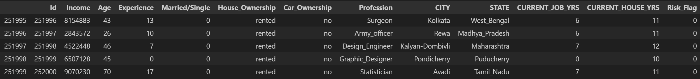
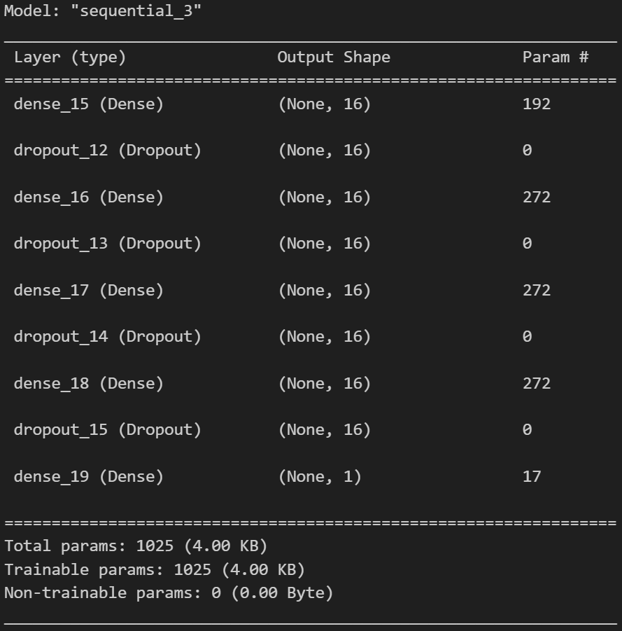
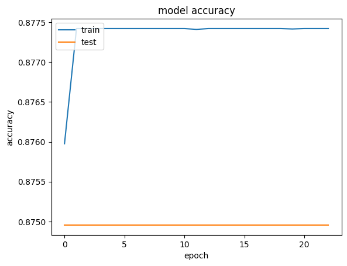
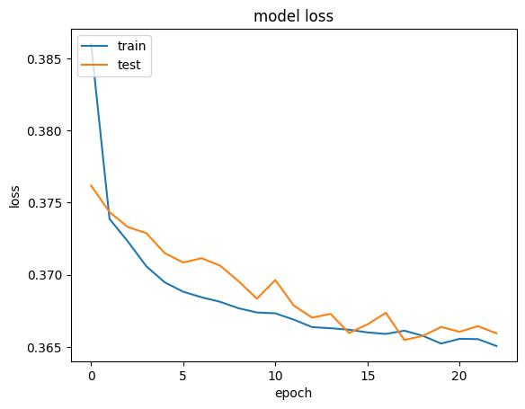

# LoanDefaultRisk
This project uses a Deep Learning approach to predict the likelihood of a customer defaulting on a loan. Using behavioral data (income, age, profession, house ownership, etc.), we built a Neural Network to classify high-risk vs. low-risk borrowers.

The model is trained on the Kaggle Loan Prediction Dataset containing 252,000 records.

---

## Data & Preprocessing
The dataset underwent significant transformation:
* Categorical Mapping: Binary values created for Married/Single, Car_Ownership, and House_Ownership.
* Feature Selection: Dropped non-predictive features like Id.
* Scaling: Applied normalization to continuous variables like Income and Experience.

## Model Architecture
* Input Layer: Matching the feature set dimensions.
* Hidden Layers: Multiple Dense layers with ReLU activation.
* Dropout: Included to prevent overfitting.
* Output Layer: Single neuron with Sigmoid activation for binary classification.

## Results

